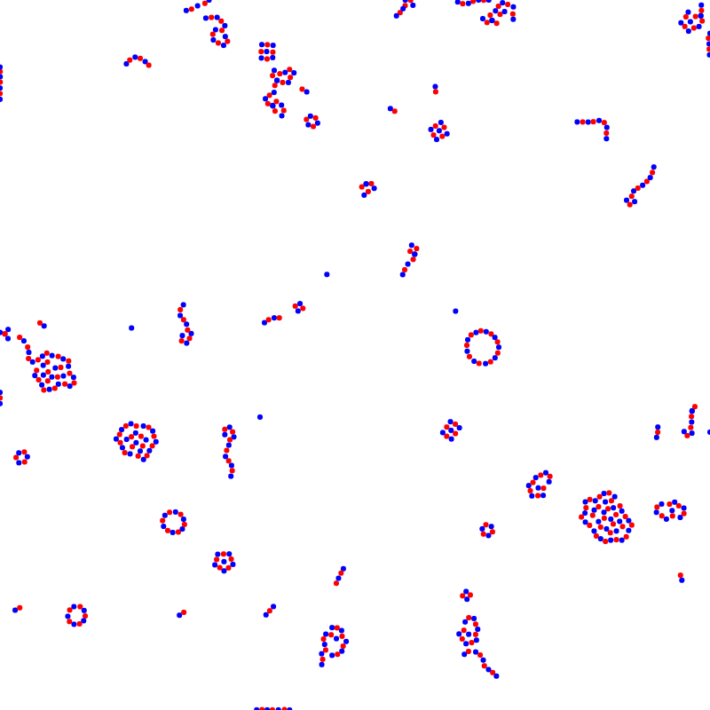

# js-particles

This is the JS reference for my WebAssembly demo project [wasm-particles](github.com/KargJonas/wasm-particles). The "simulation" imitates electromagnetic attraction and repulsion between two types of differently charged particles. Additionally, there is friction and primitive collision detection.

